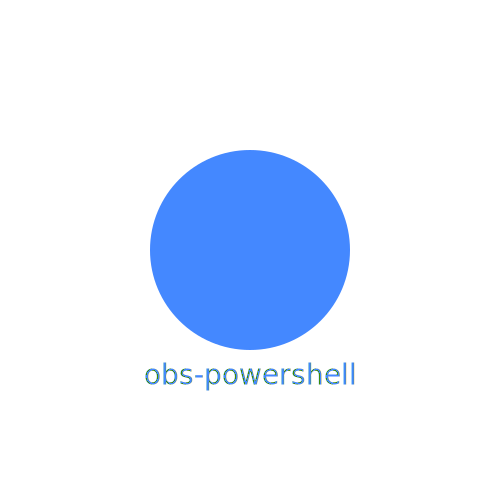

obs-powershell is a PowerShell module that lets you script Open Broadcast Studio.

## Getting Started

### Installing and importing

obs-powershell is available on the PowerShell gallery, so you can use these two simple lines to install / import

~~~PowerShell
Install-Module obs-powershell -Scope CurrentUser -Force
Import-Module obs-powershell -PassThru -Force
~~~

### Getting Connected

Before you can use obs-powershell, you'll need to Connect-OBS.

You should only need to do this once: obs-powershell will cache this information.

You can find your WebSocketToken in obs studio in Tools -> WebSocket Server Settings -> Show Connect Info.

Copy the Server Password and set it into a variable, $myToken

~~~PowerShell
Connect-OBS -WebSocketToken $myToken
~~~

After you've done this once, obs-powershell will attempt to connect every time the module is loaded.

### A Quick Example

Once you're connected, check out this nifty short sample of what you can do:

~~~PowerShell
# Show-OBS lets you show all sorts of things.
# It will return a scene item.
$Stars = Show-OBS -Uri "https://pssvg.start-automating.com/Examples/Stars.svg"
Start-Sleep -Milliseconds 50
# We can .Hide/.Disable scene items
$Stars.Hide()
Start-Sleep -Milliseconds 50
# We can .Show/.Enable scene items
$Stars.Show()
Start-Sleep -Milliseconds 50
# We can make an item small
$Stars.Scale(0.1)
Start-Sleep -Milliseconds 50
# We can fit it to the screen
$stars.FitToScreen()
Start-Sleep -Milliseconds 50
# and we can make it big again, with an animation
$Stars.Scale("1%","100%","00:00:01")
Start-Sleep -Seconds 1

# We can do even more broad animations, like moving things across the screen.
$Stars.Animate(@{
    X = "-25%"
    Y = "50%"
    Scale = "20%"
}, @{
    X = "125%"
    Y = "50%"
    Scale = "50%"
    Rotation = 180
}, "00:00:05")
Start-Sleep -Seconds 1

# To see what any object can do in obs-powershell, run Get-Member.
$stars | Get-Member
~~~

## OBS-PowerShell Effects

obs-powershell gives you the ability to store and create effects that run over time.

For instance, we can FadeIn our stars

~~~PowerShell
# Start the FadeIn effect on 'Stars.svg'
$Stars | Start-OBSEffect -EffectName "FadeIn"
Start-sleep -seconds 1

# Start the FadeOut effect on 'Stars.svg'
$Stars | Start-OBSEffect -EffectName "FadeOut"
Start-sleep -seconds 1

# Start the Colorloop effect on 'Stars.svg'
$Stars | Start-OBSEffect -EffectName "ColorLoop"
Start-sleep -seconds 1

# You can get all loaded effects with Get-OBSEffect
Get-OBSEffect
~~~

## Examples

### Getting all scenes

~~~PowerShell
Get-OBSScene
~~~

### Getting all inputs

~~~PowerShell
Get-OBSInput
~~~

### Getting OBS Stats
~~~PowerShell
Get-OBSStats
~~~

### Getting all kinds of available inputs
~~~PowerShell
Get-OBSInputKind
~~~

### Getting all monitors

~~~PowerShell
Get-OBSMonitor
~~~

### Getting Recording Status
~~~PowerShell
Get-OBSRecordStatus
~~~

### Starting Recording
~~~PowerShell
Start-Recording # an alias to Start-OBSRecord 
~~~

### Stopping Recording
~~~PowerShell
Stop-Recording # an alias to Stop-OBSRecord
~~~

### Start Recording, Wait 5 seconds, Stop Recording, and Play the Recording.
~~~PowerShell
Start-OBSRecord

Start-Sleep -Seconds 5

Stop-OBSRecord |
    Invoke-Item
~~~

### Enabling all sources in all scenes
~~~PowerShell
Get-OBSScene |
    Select-Object -ExpandProperty Scene
    Get-OBSSceneItem |
    Set-OBSSceneItemEnabled -sceneItemEnabled
~~~

### Disabling all sources in all scenes
~~~PowerShell
Get-OBSScene |
    Select-Object -ExpandProperty Scene
    Get-OBSSceneItem |
    Set-OBSSceneItemEnabled -sceneItemEnabled:$false
~~~

## How it Works

obs-powershell communicates with OBS with the obs websocket.

obs-powershell has a command for every websocket request.

Because the obs-websocket cleanly documents it's protocol, most commands in obs-powershell are automatically generated with [PipeScript](https://github.com/StartAutomating/PipeScript).

* [Full List Of Commands](docs/obs-powershell-commands.md)
* [Full list of websocket commands](docs/obs-powershell-websocket-commands.md)

## Depdendencies

To use obs-powershell, you'll need OBS and PowerShell Core.  You can run both of these on any operating system.

### Specific Command Requirements

Some commands in obs-powershell will not work unless you have additional software installed.

|Commands|Dependency|
|-|-|
|Add/Set-OBSVLCSource|[VLC](https://www.videolan.org/vlc/)|
|Add/Set-OBS3DFilter |[3D Effect](https://obsproject.com/forum/resources/3d-effect.1692/)|
|Add/Set-OBSShaderFilter|[obs-shaderfilter 2.0+](https://obsproject.com/forum/resources/obs-shaderfilter.1736/)
|Add/Set/Get-OBSWaveformSource|[waveform source](https://obsproject.com/forum/resources/waveform.1423/)

